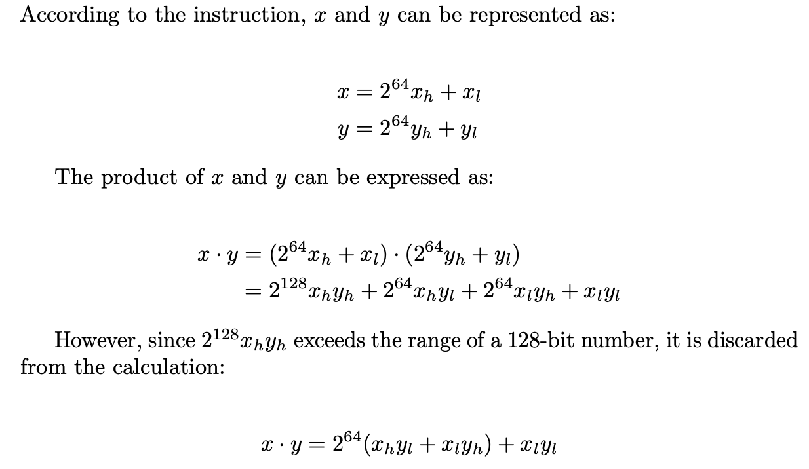

# Solution to hw3

## Question 1

(LaTex调中文有点麻烦)



```assembly
store_prod: 
  # %rdi: dest, %rsi: x, %rdx: y
  movq    %rdx, %rax    # 将y的值存到%rax中
  cqto							    # 将存在%rax中的64bit值以保留符号的形式拓展到%rdx:%rax中，变												# 为128bit，即若y为正或零，则rdx全为0，反之则全为1
  movq    %rsi, %rcx    # 将x的值存到%rcx中
  sarq    $63, %rcx			# 将%rcx的值算数右移63位，即生成一个64位的掩码，若x为正，则全												#	为0， 若x为负，则全为1
  imulq   %rax, %rcx    # 计算y_l * x_h
  imulq   %rsi, %rdx    # 计算x_l * y_l
  addq    %rdx, %rcx    # 将两结果相加
  mulq    %rsi          # 计算x_l * y_l
  addq    %rcx, %rdx    # 再将两结果相加
  movq    %rax, (%rdi)  # 用小端法将结果的低64位存入内存中
  movq    %rdx, 8(%rdi) # 将结果的高64位存入内存中，接在低64位之后
  ret
```

## Qestion 2

```C
long cread_alt(long *xp) {
  long d = 0;
  /* 即然对指针所指的内存空间访问有危险，就用指针本身代替 */
  long *res = xp ? xp : &d;
  return *res;
}
```

```assembly
cread:
.LFB0:
        testq   %rdi, %rdi
        je      .L3
        movq    (%rdi), %rax
        ret
.L3:
        movl    $0, %eax
        ret
```

```assembly
cread_alt:
        movq    $0, -8(%rsp)
        leaq    -8(%rsp), %rax
        testq   %rdi, %rdi
        cmove   %rax, %rdi
        movq    (%rdi), %rax
        ret
```

## Question 3

```C
typedef enum { MODE_A, MODE_B, MODE_C, MODE_D, MODE_E } mode_t;

long switch3(long *p1, long *p2, mode_t action) {
  long result = 0;
  switch(action) {
    case MODE_A:
      result = *p2;
      *p2 = *p1;
      break;
    case MODE_B:
      result  = *p1 + *p2;
      *p1 = result;
      break;
    case MODE_C:
      *p1 = 59;
      result = *p2;
      break;
    case MODE_D:
      *p1 = *p2; // 这里有fall through
    case MODE_E:
      result = 27;
      break;
    default:
      result = 12；
  }
  return result;
}
```

## Question 4

```C
long switch_prob(long x, long n) {
  long result = x;
  switch(n) {
    case 60:
    case 62:
      result = x * 8;
      break;
    case 63:
      result = x >> 3;
      break;
    case 64:
      result = (x << 4) - x;
    case 65:
      x = x * x;
    default:
      result = x + 0x4B;
  }
  return result;
}
```

