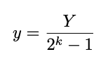

# Solution to hw2

## Question 1

A. 

B. (a): **5/7** (b): **2/5** (c): **19/63**

## Question 2

| Description                 | HEX  | M         | E    | V                    | D        |
| :-------------------------- | ---- | --------- | ---- | -------------------- | :------- |
| -0                          | 8000 | 0         | 0    | -0                   | -0.0     |
| smallest number > 2         | 4801 | 1025/1024 | 2    | 1025x2<sup>-9</sup>  | 2.001953 |
| 512                         | 6000 | 1         | 9    | 512                  | 512.0    |
| biggest denormalized number | 03FF | 1023/1024 | -14  | 1023x2<sup>-24</sup> | 0.000061 |
| -inf                        | FC00 | \         | \    | -inf                 | -inf     |
| 3BB0                        | 3BB0 | 123/64    | -1   | 123x2<sup>-7</sup>   | 0.960938 |

## Question 3

| A      |       | B      |       |
| ------ | ----- | ------ | ----- |
| Binary | Value | Binary | Value |
|1 01110 001|-9/16|1 0110 0010|-9/16|
|0 10110 101|208|0 1110 1010|208|
|1 00111 110|-7/1024|1 0000 1001|-7/1024|
|0 00000 101|5/2<sup>17</sup>|0 0000 0001|1/1024|
|1 11011 000|-4096|1 1110 1111|-298|
|0 11000 100|768|0 1111 0000|+inf|

## Question 4

A. 该式恒为真，因为int到double的转换没有损失，将两个数据同时转换为float时，即使发生舍入，结果也一致。

B. 该式不恒为真，当x取0， y取INT_MIN时，结果为0。

C. 该式恒为真，x、y、z均为32bit整数，相加的和也不会超过64bit浮点数的范围，不会发生溢出。

D. x = 0x8FFF7281, y = 0x8FFF738, z = 0x0F482929（dx和dy相乘溢出或dy和dz相乘溢出即可）。

C. 该式不恒为真，当x取0，z取1时，结果为0。

## Question 5

```C
float fpwr2(int x) {
  unsigned exp, frac;
  unsigned u;
  if (x < -126) {
    exp = 0;
    frac = 0;
  } else if (x < -126 + 23) {
    exp = 0;
    frac = 1 << (x + 126);
  } else if (x <= 127) {
    exp = x + 127;
    frac = 0;
  } else {
    exp = 0xFF;
    frac = 0;
  }
  u = exp << 23 | frac;
  return u2f(u);
}
```

## Question 6

A. 11.0010010000111111011011

B. 11.001001001001...(y=001. k=3)

C. 9
